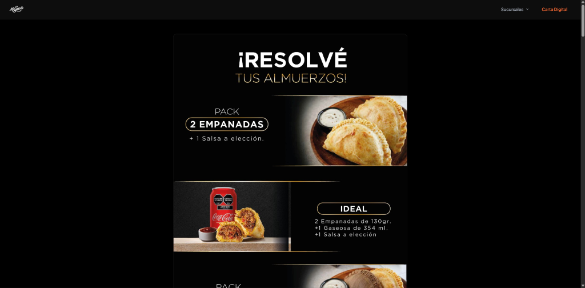
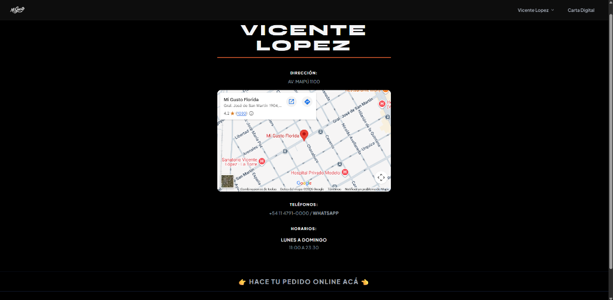
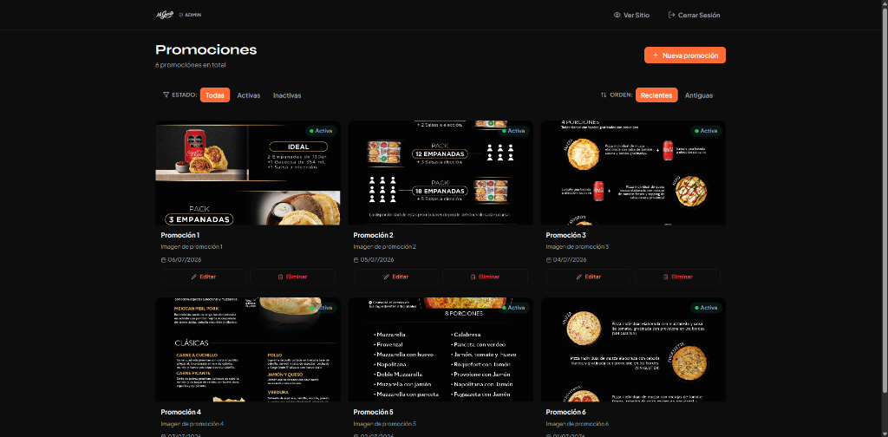
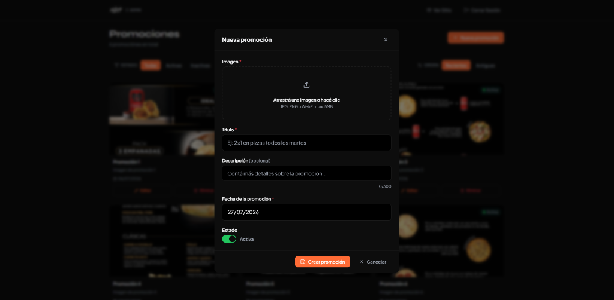

# 🍴 Mi Gusto – Carta Digital

Feed scrolleable de promociones con panel de administración completo, construido con React + Firebase.

---

## 📸 Galería de Imágenes

<table>
  <tr>
    <td align="center" width="50%">
      <b>Feed de Promociones (Público)</b>
       
      
    </td>
    <td align="center" width="50%">
      <b>Información de Sucursal</b>
       
      
    </td>
  </tr>
  <tr>
    <td align="center" width="50%">
      <b>Panel de Administración</b>
       
      
    </td>
    <td align="center" width="50%">
      <b>Crear Nueva Promoción</b>
       
      
    </td>
  </tr>
</table>

---

## ✨ Características

- **Feed público**: Scroll vertical infinito de promociones con imágenes, lazy loading y animaciones
- **Panel admin**: CRUD completo con upload de imágenes drag & drop
- **Autenticación**: Firebase Auth con sesión persistente
- **Diseño responsive**: Mobile-first, perfecto en desktop
- **Filtros y orden**: Por estado (activa/inactiva) y fecha
- **Toast notifications**: Feedback de acciones en tiempo real

---

## 🛠️ Stack

| Tecnología | Uso |
|---|---|
| React 18 + Vite | Frontend |
| TailwindCSS | Estilos |
| React Router v6 | Navegación |
| Firebase Auth | Autenticación |
| Firestore | Base de datos |
| Firebase Storage | Almacenamiento de imágenes |
| React Hook Form + Zod | Formularios y validación |
| Lucide React | Iconos |

---

## 📋 Scripts disponibles

| Comando | Descripción |
|---|---|
| `npm run dev` | Servidor de desarrollo |
| `npm run build` | Build de producción |
| `npm run preview` | Preview del build |

---

## 🎨 Paleta de colores

| Color | Valor | Uso |
|---|---|---|
| Primario | `#FF6B35` | Botones, acentos |
| Secundario | `#2EC4B6` | Badges "Vigente", éxito |
| Fondo | `#FFFFFF` | Fondo principal |
| Fondo secundario | `#F7F7F7` | Fondo de página |
| Texto | `#1A1A1A` | Texto principal |
| Texto secundario | `#666666` | Texto auxiliar |
| Error | `#E63946` | Errores |

---

## 🗺️ Rutas

| Ruta | Descripción | Acceso |
|---|---|---|
| `/` | Feed de promociones | Público |
| `/login` | Inicio de sesión | Público |
| `/admin` | Panel de administración | Solo usuarios autenticados |

---

## 🔒 Seguridad

- Las rutas de admin están protegidas: redirigen a `/login` si no hay sesión
- Las reglas de Firestore y Storage permiten lectura pública pero escritura solo autenticada
- Las imágenes se validan por tipo y tamaño antes de subirse
- Los formularios tienen validación tanto client-side (Zod) como protección Firebase

---

## 📸 Formatos de imagen soportados

- JPEG / JPG
- PNG  
- WebP
- Tamaño máximo: **5MB**
- Se recomienda relación de aspecto **16:9** o **4:3**
